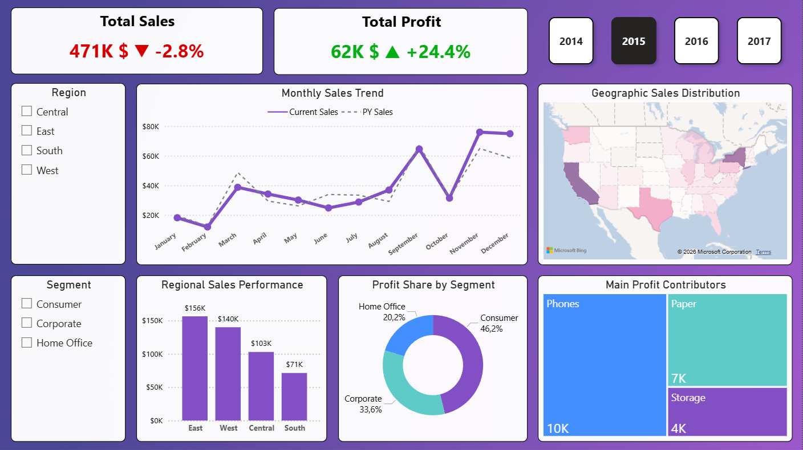
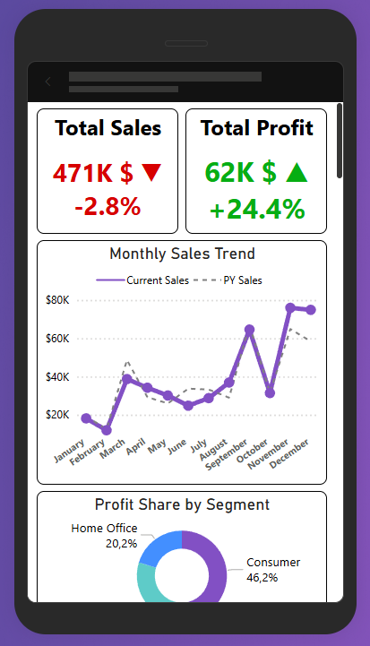

# 📊 Sales Performance Analysis – Executive Dashboard (Power BI)

---

## 📌 Project Overview

This project delivers an interactive executive Power BI dashboard designed to provide a concise and actionable view of sales performance, while enabling deep multidimensional analysis (temporal, geographic, and segment-based).

The solution combines advanced DAX modeling, Year-over-Year (YoY) comparison, and executive-oriented UX design to support fast and informed decision-making.

---

## 🎯 Business Challenge

How can decision-makers access a synthetic, decision-ready view of performance while retaining the ability to drill down into detailed trends?

---

## 🔍 Key Insights

- Sales declined by 2.8% YoY while profit increased by 24.4%, indicating margin optimization.
- Consumer segment drives 46% of total profit.
- Strong seasonality observed in Q4 with peak performance in November.
- Phones category is the main profit contributor.

---

## 🛠 Technical Stack

- Power BI
- DAX (Advanced Time Intelligence)
- Data Modeling (Fact Table + Dedicated Date Dimension)
- Business Logic Encapsulation
- KPI Custom Visual Design

---

### 🖥️ Desktop Version
> [!TIP]
> This version includes interactive tooltips for granular data exploration.



---

### 📱 Mobile Optimization
> [!IMPORTANT]
> Fully responsive layout designed for executive-level monitoring on smartphones.



---

## 🚀 Technical Highlights

### 🔹 Advanced DAX & Time Intelligence
Robust Year-over-Year measures with strict filter context control and edge case handling (e.g., missing historical data).

### 🔹 Centralized Business Logic
Reusable measures ensure metric consistency across all levels of granularity (Year, Month, Region, Segment).

### 🔹 Custom KPI Cards
Hybrid KPI visuals combining:
- Absolute values
- YoY variation
- Directional indicators (▲ ▼)

All within a clean executive UI.

### 🔹 Multidimensional Analysis
Interactive performance exploration by:
- Region
- Customer Segment
- Product Category
- Geographic distribution

Systematic comparison with Prior Year (PY).

### 🔹 Executive-Oriented UX
Clear information hierarchy and high signal-to-noise ratio for rapid insight consumption.

---

## 🧠 Technical Deep Dive: DAX Logic 
To demonstrate my technical proficiency, here are two key implementations from the project:

### 1. Robust Data Modeling (Date Table)
Instead of relying on Power BI's "Auto Date/Time", I developed a custom Calendar table to ensure consistent time intelligence and optimized model performance.

```dax
Dim_Date = 
ADDCOLUMNS (
    CALENDAR ( MIN ( Fact_Sales[Order Date] ), MAX ( Fact_Sales[Order Date] ) ),
    "Year", YEAR ( [Date] ),
    "Month", FORMAT ( [Date], "MMM" ),
    "Month Number", MONTH ( [Date] )
)
```

### 2. DAX Ingenuity (Dynamic KPI Card)
One of the key technical challenges was to create a streamlined executive view. Instead of using multiple visuals, I developed a custom DAX measure to consolidate the **Value**, **Trend Indicator**, and **YoY Percentage** into a single, high-impact label.

### Total Profit + YoY Measure:
```dax
Total Profit + YoY = 
VAR ProfitValue = [Total Profit]
VAR ProfitValueK = ProfitValue / 1000
VAR YoY = [Profit YoY %]
VAR Arrow =
    IF(
        YoY > 0,
        "▲ ",
        IF(YoY < 0, "▼ ", "")
    )

RETURN
IF(
    ISBLANK(ProfitValue),
    BLANK(),
    FORMAT(ProfitValueK, "#,##0") & "K $ " &
    Arrow &
    FORMAT(YoY, "+0.0%;-0.0%")
)
```   

## 📈 Business Impact

✔ Immediate identification of performance gaps (e.g., -2.8% YoY sales decline)  
✔ Clear visibility of profit drivers (Phones, Paper, etc.)  
✔ Strategic cross-analysis across geography and segments  
✔ Faster data-driven arbitration  

---

## 💾 Data Source

The analysis is based on the Sample Superstore dataset, a standard retail dataset used to demonstrate advanced Business Intelligence capabilities.

---

## 📁 Repository Structure

* **assets/** → Dashboard screenshots (Desktop & Mobile)
* **pbix/** → Power BI project file
* **docs/** → Documentation and data sources

---

## 👤 Author

**Emmanuel Chevalier**  
Data Analyst | Power BI & DAX  
Microsoft Power BI Data Analyst (Coursera)
